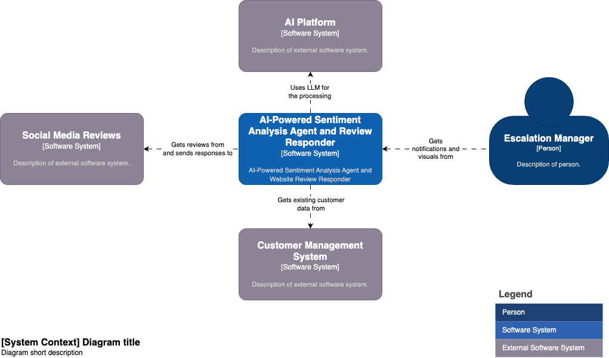
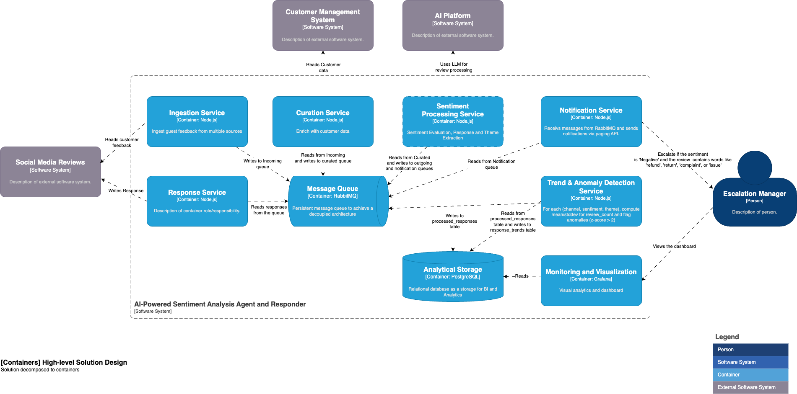

# AI-Powered Sentiment Analysis Agent & Review Responder

*Version: 2025-06-09*  
*Status: Draft → Review*  

---

## 1 — Purpose & Business Benefits
The solution delivers an **automated, end‑to‑end pipeline** that ingests guest feedback from multiple public and private sources, performs AI‑based sentiment and theme analysis, and surfaces **actionable insights** (alerts, dashboards, draft replies) for restaurant managers.  

### Why automate?
| Manual Approach | Proposed Solution |
|-----------------|-------------------|
| Human reviewers need hours/days to read and tag feedback. | AI classifies the same volume in **seconds**, 24×7. |
| Inconsistent tagging and subjective sentiment scoring. | **Predictable quality** via deterministic prompts and evaluation rules. |
| Hidden cost of outsourced providers (€0.20–€1.00 per review). | **Pay‑per‑use** (≈€0.01–€0.03 per review with GPT‑4o‑mini) and no long‑term vendor lock‑in. |
| Little to no trend detection or cross‑channel correlation. | Built‑in **trend & anomaly detection** to surface emerging issues early. |

---

## 2 — Objectives & Requirements

| ID | Requirement |
|----|-------------|
| R1 | Ingest feedback from social media (Google Maps, Instagram, Facebook) in JSON format.|
| R2 | Detect language and classify sentiment (positive / neutral / negative / mixed).|
| R3 | Extract themes (cleanliness, service, menu, atmosphere … configurable).|
| R4 | Surface emerging trends & anomalies across time, store-location and channel.|
| R5 | Trigger alerts when * negative sentiment exceeds threshold * VIP complaints * spikes in a theme.|
| R6 | Suggest human-readable response drafts, ready for staff to post back.|
| R7 | Deployable in a single Docker Compose stack; infra codified in Terraform.|
| R8 | Written in Node.js (ES modules, TypeScript recommended).|
| R9 | Cost-efficient: pay-per-use OpenAI API; local queue & db use OSS.|

---


## 3 - Solution Summary


### System Context (C0)


**Narrative**  
* AI service sits between **external review channels** and the **restaurant’s operations team**.  
* It enriches data, calls the **OpenAI Platform** for NLP, stores results, then notifies the **Escalation Manager** (or store managers) through Slack/E‑mail.  
* Optionally pushes structured data back into the **Customer Management System** for 360° guest view.

### Expected Outcomes
* ⏱ **60–90 % faster** response time to negative reviews.  
* 📈 Trend reports allow **proactive fixes** (menu items ↔ complaints).  
* 💶 **30–70 % OPEX reduction** versus manual/offshore review processes.

---

## 4 — High‑Level Design (C1)


**Core Containers**
1. **Ingestion Svc** – Pulls/receives raw feedback and drops messages onto AMQP queue.  
2. **Curation Svc** – Cleans, enriches (language detection, metadata), anonymises PII.  
3. **Sentiment Processing Svc** – Calls OpenAI functions for sentiment, theme & response generation.  
4. **Trend & Anomaly Svc** – Batch/stream analytics for spikes (z‑score, EWMA).  
5. **Notification Svc** – Formats alerts & sends via Slack, Teams, E‑mail.  
6. **Response Svc** – Serves draft replies through a lightweight REST/GraphQL API to the manager UI.  
7. **Analytical Storage** – PostgreSQL with JSONB columns for embeddings & model output.  
8. **Monitoring & Viz** – Grafana dashboards (Prometheus + Loki data sources).


---

## 5 — Technology Stack

| Layer | Technology | Rationale |
|-------|------------|-----------|
| **Language Runtime** | Node.js 18, TypeScript 5 | Uniform dev experience, mature ecosystem. |
| **AI / NLP** | OpenAI GPT‑4o & GPT‑4o‑mini | Native JSON output, function‑calling, lower token cost. |
| **Data Store** | PostgreSQL 15 | Relational + JSONB, analytics functions, familiar to team. |
| **Message Bus** | RabbitMQ 3.12 | Simple, battle‑tested, good Node.js client libraries. |
| **Container Runtime** | Docker 23, Compose v2 | Local parity with cloud images. |
| **IaC** | Terraform 1.7 (AWS ECS Fargate baseline) | Reproducible, modular. |
| **Observability** | Prometheus + Grafana + Loki | Metrics, dashboards, log aggregation. |
| **CI/CD** | GitHub Actions | Build, test, scan, push to registry, deploy. |

---

## 6 — Data Flow Walk‑through

| # | Stage | Description | Tech / Component |
|---|-------|-------------|------------------|
| ① | **Collection** | Webhooks / scheduled pulls push raw messages to `feedback.raw` queue. | Ingestion Svc |
| ② | **Curation** | Remove PII, detect language (`opt.detectLang`), add location/channel metadata. | Curation Svc |
| ③ | **Sentiment + Themes** | Chat Completion (model=gpt‑4o‑mini) in JSON mode returns `{sentiment, score, themes[]}`. | Sentiment Processing Svc |
| ④ | **Response Draft** | For negative or mixed sentiment, second prompt drafts empathetic reply. | Response Svc |
| ⑤ | **Persist** | Upsert into `feedback` (raw + analysis), `theme_hit` tables. | Analytical Storage |
| ⑥ | **Detect Trends** | Nightly job runs z‑score & seasonal‑decompose over 30‑day window. | Trend & Anomaly Svc |
| ⑦ | **Notify** | Inserts into `alerts` triggers NOTIFY; Notification Svc sends Slack/E‑mail. | Notification Svc |
| ⑧ | **Visualise** | Next.js dashboard queries GraphQL for charts; managers review & post replies. | Monitoring & Viz |


---

## 7 — Container Details

### 7.1 Ingestion Service

### 7.2 Curation Service

### 7.3 Sentiment Processing Service

### 7.4 Notification Service

### 7.5 Response Service

### 7.6 Trend & Anomaly Detection Service

### 7.7 Message Queue

### 7.8 Analytical Storage

### 7.9 Monitoring and Visualization


---

## 8 — Production Considerations

/ Deploy in AWS ECS Fargate/ 
 
/ Use cloud-native services (rabbitmq, postgresql) for scalability /

/ Move some services that are not running frequently to lambda functions (e.g. summarization, archival) /

/ tagging and cost monitoring /

/ Security Hardening Checklist /

/ other options /


---

## 9 — Future Enhancements

* Add processing of website reviews
* Complement with personal discount vouchers to increase customer retention
* Auto-translate & respond in customer’s language.
* Evaluate AI responses to improve prompts.
* Proactively invite customers to leave feedback

## 10 — Getting Started Locally

```bash
git clone https://github.com/your‑org/sentiment‑agent.git
cd sentiment‑agent
cp .env.example .env         # fill secrets
docker compose up --build
# open http://localhost:3000 dashboard with mock data
```

> **Need help?** Open a GitHub issue or reach the Service Delivery Hub team on Slack.