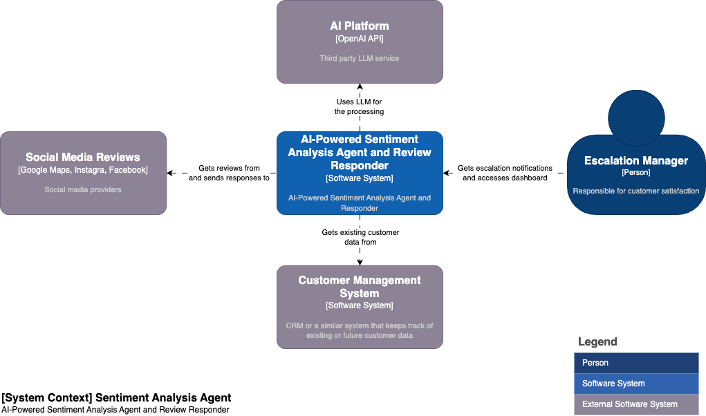
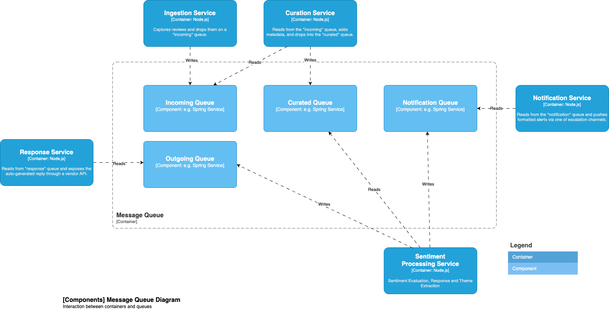

# AI-Powered Sentiment Analysis Agent & Review Responder

*Version: 2025-06-09*  
*Status: Published*  


## 1 — Problem Statement
Guest feedback pours in around the clock through social media, review sites, web surveys and email. Relying on people alone to read, tag and reply creates four critical pain points:

- Slow reaction time – Hours or days can pass before staff even notice a frustrated customer, missing the window to recover the experience.

- Subjective, inconsistent scoring – Human reviewers interpret the same comment differently, undermining data quality.

- High operating cost – Outsourcing costs €0.20 – €1.00 per review and still cannot deliver real-time insight.

- Hidden emerging issues – Without automated trend detection, a spike in complaints is discovered only after reputational damage is done.

To break this cycle, the organisation must adopt a modern, AI-powered solution that automatically ingests feedback from every channel, applies advanced sentiment and theme analysis within seconds, and pushes actionable alerts and draft responses directly to escalation managers. Deploying such a platform transforms feedback from a labour-intensive burden into a continuous, real-time signal for improving guest experience and protecting brand reputation.

---

## 2 — Purpose & Requirements

**Purpose**

Deliver a lightweight, modular reference implementation that automatically ingests guest feedback from multiple sources, analyses sentiment and themes in near‑real‑time, and surfaces actionable insights and auto‑drafted responses to restaurant staff. The blueprint favours open, composable services over monoliths, keeps cost low, and can be re‑used or extended for other industries

**Requirements**

| ID | Requirement |
|----|-------------|
| R1 | Ingest feedback from social media (Google Maps, Instagram, Facebook) in JSON format.|
| R2 | Detect language and classify sentiment (positive / neutral / negative / mixed).|
| R3 | Extract themes (cleanliness, service, menu, atmosphere … configurable).|
| R4 | Surface emerging trends & anomalies across time, store-location and channel.|
| R5 | Trigger alerts when * negative sentiment exceeds threshold * VIP complaints * spikes in a theme.|
| R6 | Suggest human-readable response drafts, ready for staff to post back.|
| R7 | Deployable in a single Docker Compose stack; infra codified in Terraform.|
| R8 | Written in Node.js (ES modules, TypeScript recommended).|
| R9 | Cost-efficient: pay-per-use OpenAI API; local queue & db use OSS.|

---


## 3 - Solution Summary

The solution delivers a configurable and scalable pipeline that gets reviews from social media providers, enriches the context with existing customer data, uses LLM from an AI Platform to generate the response and escalates to the manager as based on pre-defined rules.

**Expected Outcomes**
* ⏱ 60–90 % faster response time to negative reviews.  
* 📈 Trend reports allow proactive fixes (menu items ↔ complaints).  
* 💶 30–70 % OPEX reduction versus manual/offshore review processes.

**Narrative**  
* AI service sits between external review channels and the escalation manager.  
* It enriches data with existing customer information, calls the OpenAI Platform for NLP, stores results, then notifies the Escalation Manager (or store managers) through one or many escalation channels.  
* Can be expanded to push structured data back into the Customer Management System for 360° guest view.

**Context Diagram**



---

## 4 — High‑Level Design

The solution is a lightweight, modular pipeline that ingests guest feedback from every major channel, enriches it with existing customer data, applies OpenAI-powered sentiment and theme analysis in near-real-time, and surfaces actionable insights (alerts, dashboards, write replies) to restaurant staff—while remaining easy to extend or repurpose for other industries.

End-to-end flow

- Ingestion Svc captures reviews and drops them on a *incoming* queue.
- Curation Svc reads from the *incoming* queue, adds metadata, and drops into the *curated* queue. Future enhancements can include data quality check, language detection, PII masking and other features.
- Sentiment Processing Svc reads from *curated* queue, invokes the OpenAI API to classify sentiment, extract themes, writes a response, and drops the message to the *response* queue and optionally drops to the *notification* queue. It also writes the data with response to the analytical table for further trend processing.
- Trend & Anomaly Svc scans rolling windows for spikes or emerging issues.
- Notification Svc reads from the *notification* queue and pushes formatted alerts via one of escalation channels.
- Response Svc reads from *response* queue and exposes the auto-generated reply through a vendor API. 
- Analytical Storage (PostgreSQL) holds raw feedback and analytics summary data.
- Monitoring & Viz (Grafana) provides real-time dashboards and system health (future).

This open, composable architecture keeps costs low, scales horizontally, and isolates concerns—making it straightforward to plug in new data sources, analytics, or notification channels without a monolithic rewrite.


**Container Diagram**


---

## 5 — Technology Stack

| Layer | Technology | Rationale |
|-------|------------|-----------|
| **Language Runtime** | Node.js:latest | Uniform dev experience, mature ecosystem. |
| **AI / NLP** | OpenAI GPT‑3o‑mini | Native JSON output, function‑calling, lower token cost. |
| **Data Store** | PostgreSQL:latest | Relational + JSONB, analytics functions, familiar to team. |
| **Message Bus** | RabbitMQ:latest | Simple, battle‑tested, good Node.js client libraries. |
| **Container Runtime** | Docker:latest | Local parity with cloud images. |
| **IaC** | Terraform (AWS ECS Fargate baseline) | Reproducible, modular. |
| **Observability** | Grafana | Dashboards, natural expansion to metrics and log aggregation if needed in the future. |

---

## 6 — Data Model

### Message Queue




### Analytical Storage


**Table: processed_responses**

```sql
    CREATE TABLE IF NOT EXISTS processed_responses (
      review_id INT PRIMARY KEY,
      review_date TIMESTAMPTZ,
      channel TEXT,
      external_customer_id TEXT,
      customer_name TEXT,
      review_text TEXT,
      star_rating INT,
      location TEXT,
      escalation BOOLEAN DEFAULT FALSE,
      sentiment TEXT,
      theme TEXT,
      ai_response TEXT,
      created_at TIMESTAMPTZ DEFAULT NOW()
    )
```

**Table: response_trends**

```sql
    CREATE TABLE IF NOT EXISTS response_trends (
      trend_date DATE,
      channel TEXT,
      location TEXT,
      sentiment TEXT,
      theme TEXT,
      review_count INT,
      escalation_count INT DEFAULT 0,
      avg_star_rating FLOAT,
      anomaly BOOLEAN DEFAULT FALSE,
      PRIMARY KEY (trend_date, channel, sentiment, theme)
    )
```

---

## 7 — Production Considerations

* Integrate with vendor social media APIs for automated ingestion and response.
* Integrate with a messaging service (WhatsApp, Slack, Telegram, Email) to allow escalation notifications.
* Deploy in AWS ECS Fargate with proper tags to ensure cost monitoring.
* Use cloud-native services (rabbitmq, postgresql) for horizontal scalability
* Consider switching some services that are rarely used to serverless Lambda functions. Good candidate is a Notification Svc. Current design has modular structure that makes these decisions easy.
* Follow AWS guidelines for security best practices.

---

## 8 — Future Enhancements

* Add data cleanup and PII masking.
* Complement with personal discount vouchers to increase customer retention.
* Auto-translate & respond in customer’s language.
* Evaluate AI responses to improve prompts.
* Proactively follow-up with existing custoers and invite them to leave feedback.

## 9 — Getting Started Locally

```bash
git clone https://github.com/fusion-platform-services/fps-blueprint-ai-sentiment-analysis-and-response.git
cd fps-blueprint-ai-sentiment-analysis-and-response
cp .env.example .env         # fill secrets
docker compose up --build
# open http://localhost:3003 dashboard with mock data
```

> **Found a Bug or Need help?** Open a GitHub issue.